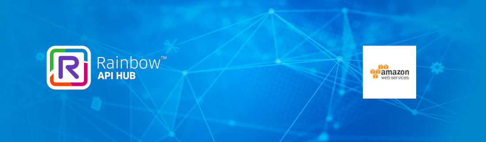
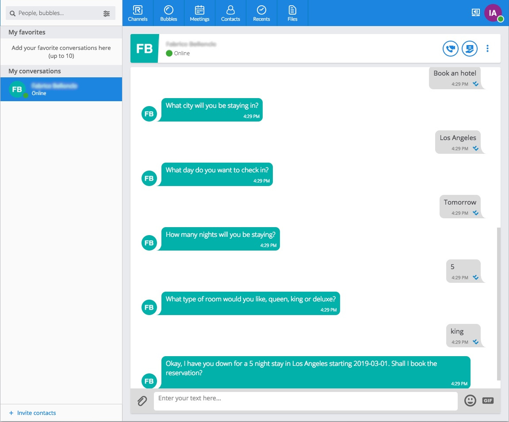
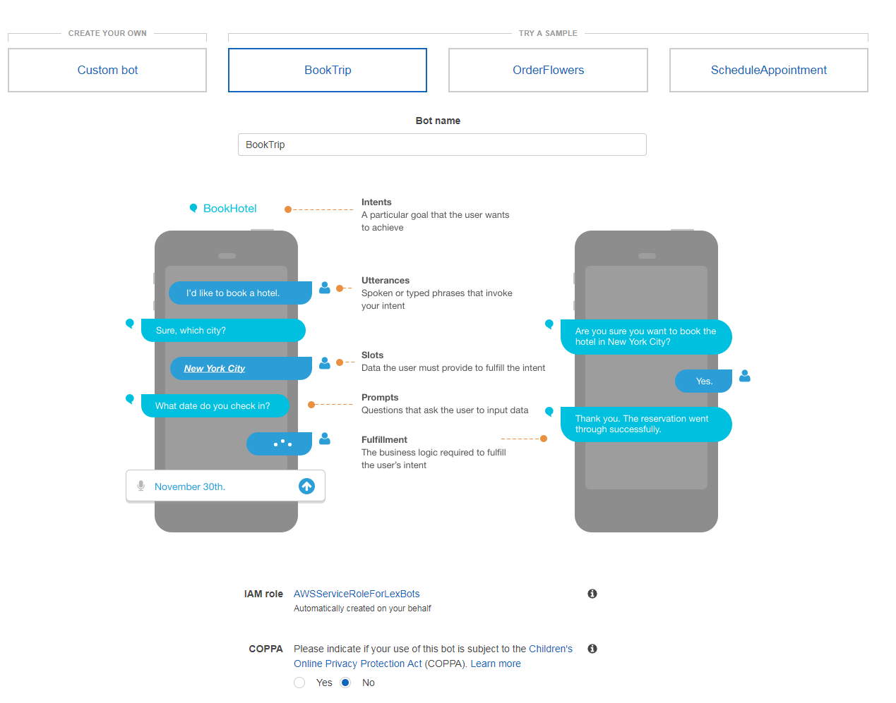
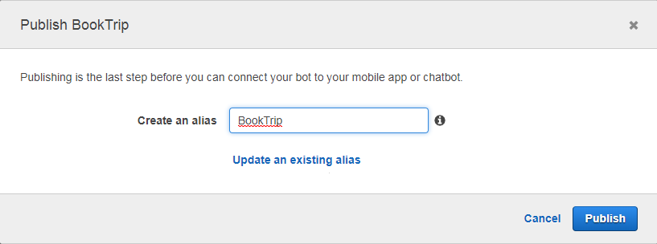

# Rainbow bot using Amazon Lex sample

## Introduction

This is a sample of how a NodeJS Rainbow bot can use the Amazon Lex capabilities. 
It is based on the **BookATrip** sample bot, but basically will works with any Lex application.

The goal of this sample it not to describe Lex in detail, plenty of resources can be found on aws websites
but to show how easily one can use **node-aws** and **rainbow-node-sdk** npm modules to leverage Lex in a rainbow bot.

More information about the rainbow-node-sdk can be found  [here](https://hub.openrainbow.com/#/documentation/doc/sdk/node/guides/Getting_Started).

The sample bot can simulate the booking of a car or an hotel using natural language.



## Installation

To install, just clone this repository, and type:

```bash
npm install
```

## Usage

### Requirements

To be able to play with this sample bot you need:  
* Your Rainbow developer account (you can create one from here: https://hub.openrainbow.com),  
* An Amazon Web Services (AWS) account (https://aws.amazon.com) with the associated access key id and secret access key.

### Configuration

You can now configure the credentials and options for the Rainbow SDK and for 
Amazon Lex.  
This sample uses the **config** module (https://www.npmjs.com/package/config).

A `config/default.json` file is provided. We recommend you make a copy of this file 
and name it `config/local.json`. The `local.json` file is used to locally store 
your credentials without pushing them in a git (this file is part of .gitignore).
There are two parts in this configuration file: one for Rainbow and one for Amazon Lex.  
Replace each value between `<` and `>` wih your associated credentials.

* Rainbow parameters and credentials
    * `<RAINBOW_HOST>`: the rainbow host where your application is deployed can be "sandbox"
    * `<RAINBOW_BOT_LOGIN>`: the login of the developer account allowed to run the host
    * `<RAINBOW_BOT_PASSWORD>`: associated developer password
    * `<RAINBOW_APPID>`: the id of the application. 
    * `<RAINBOW_APPSECRET>`: and its associated app secret. It can be retrieved with the [RAINBOW CLI](https://hub.openrainbow.com/#/documentation/doc/sdk/cli/tutorials/Managing_applications)
* Amazon Lex parameters and credentials
    * `<BOT_ALIAS>`, `<BOT_NAME>`: alias and name given to lex when you published your bot on aws. Replace both values with "BookTrip" for this sample.
    * `<AWS_REGION>`, `<AWS_ACCESS_KEY_ID>`, `<AWS_SECRET_ACCESS_KEY>`: region code, access key and secret key allowed to you on AWS.

*Tip: the list of AWS region codes can be found in this page: https://docs.aws.amazon.com/en_us/AWSEC2/latest/UserGuide/using-regions-availability-zones.html*

If you plan to use the bot in Docker, please refer to the **Docker** section below
for configuration in this case.

## Preparing the AWS Lex application 
Create a lex application based on the sample "book a trip", build it and publish it. Specify the alias **BookTrip**  
To do so 

1. Go to your [amazon aws console:](https://aws.amazon.com/?nc1=h_ls) and click in `Products` / `Machine Learning` / `Amazon Lex`.
* Click on `Get Started` and sign in with the requested authentication information.
* From the 'Create a bot' page, click on `BookTrip` , select **No** for COPPA and click on the **Create** button.  

  

  You now have a copy of the Sample bot BookTrip. 
* Wait for it finish to Build, and hit the **Publish** button.
* Publish the bot using the alias **BookTrip**  


you are now ready to use the bot.

### Running

To start, just type:

```bash
npm start
```

### Logs

Using the default configuration in `config/default.json`, Rainbow SDK logs will
be stored in the `logs` subdirectory (file with name `<date>-rainbowsdk.log`):

```javascript
        "logs": {
            "enableConsoleLogs": false,
            "enableFileLogs": true,
            "file": {
                "path": "logs",
                "level": "debug"
            }
        },    
```

Bot logs will also be stored in the `logs` directory, in a file named `rainbow-lex-sample.log`.

## Docker

This sample can also be used in docker.

### Configuration

You can configure the credentials (Rainbow SDK, Amazon Lex and) by editing the file `bot_env_file`. 
The environment variables embedded in `bot_env_file` will be used by 
`config/custom-environment-variables.json` file.

### Building the docker image

To build the docker image type:

```bash
docker build -t rainbow-lex-sample .
```

### Starting the bot service

The bot service can be started by typing:

```bash
docker-compose up
```

## Bot architecture

The sample bot is divided in different parts:
* `app.js` : main file of the application, interfaces with Rainbow
* `module/bot.js`: handle user messages with the help of Lex module, sends back response (event emitter)
* `module/lex.js`: this does the job to send a user sentence to Lex, and get back the result (intents, entities)

The bot subscribes to Rainbow SDK **rainbow_onmessagereceived** events 
(https://hub.openrainbow.com/#/documentation/doc/sdk/node/api/events#Events+event_rainbow_onmessagereceived).

When the receive message type is **chat** message we give it to the bot module (**handleMessage**) and
we mark the message as read (https://hub.openrainbow.com/#/documentation/doc/sdk/node/api/im#IM+markMessageAsRead). 

The bot.js **handleMessage** function sends the message to Lex and gets back intents and entities.  
Response messages are sent back to `app.js` using the **sendIM** event. `app.js` listens to **sendIM** bot 
messages.  

The **sendIM** handler calls the Rainbow SDK to send the message to the user 
(https://hub.openrainbow.com/#/documentation/doc/sdk/node/api/im#IM+sendMessageToJid).


